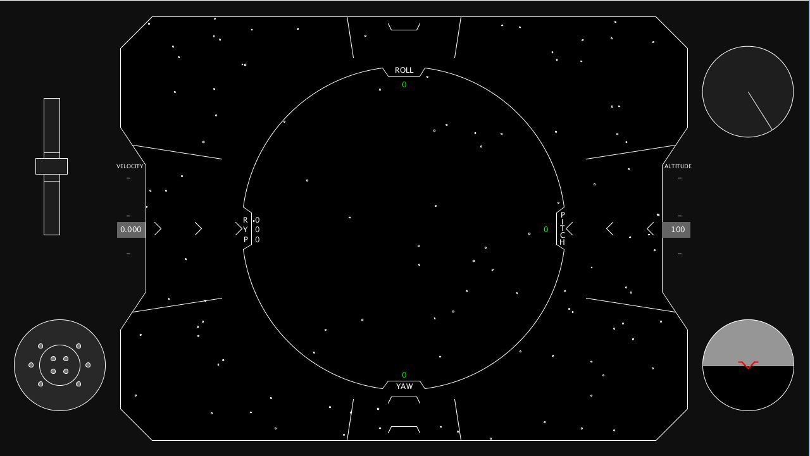
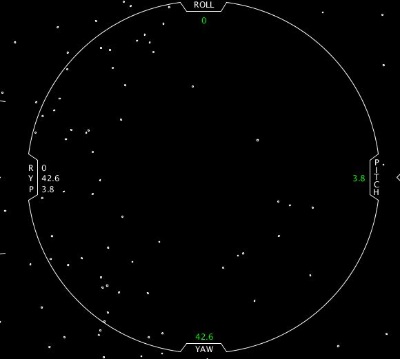
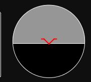
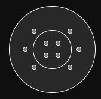
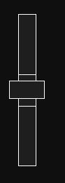

# SciFi UI Project

Name: Conor Rogers

Student Number: C17730535



# Description of the assignment

For my assignment I decided to create a user interface more specifically a Heads-Up Display (HUD) for the controls of a spacecraft. I took inspiration for my design from the recent docking of the Space X Dragon module with the International Space Station. 

There are several elements to the project which are demonstrated in the following video.

[](https://youtu.be/bctZhvw0bsI)


# Instructions

The space craft is controlled with the following inputs:

| Input | Action |
|-----------|-----------|
| w key | Pitches the spacecraft down. |
| s key | Pitches the spacecraft up. |
| a key | Rolls the spacecraft left. |
| d key | Rolls the spacecraft right. |
| q key | Yaws the spacecraft left.  |
| e key | Yaws the spacecraft right. |

The velocity of the spacecraft is controlled by moving the throttle from its central dead zone. By moving it up you increase the velocity and by moving it down you decrease velocity.

The altitude of the spacecraft changes with regard to the current velocity of the ship and its current pitch.

# How it works

I made an abstract class called UiObject. Every class in the project then extends this abstract class and is placed into an Array List of uiObjects. Each UI object is then passed its own x,y coordinates (position), size and rotation. The program then cycles through this array list in the UI draw function.

The classes used in the project are as follows:

###UiObject
This is the code used for the abstract class UiObject.

```Java
public abstract class UiObject
{
    protected UI ui;
    protected PVector position;
    protected float size;
    protected float rotation;

    public UiObject(UI ui, float x, float y, float size, float rotation)
    {
        this.ui = ui;
        position = new PVector(x,y);
        this.size = size;
        this. rotation = rotation;
    }

    public abstract void update();

    public abstract void render();
}
```

I used this as the blueprint for my UI elements as each element has it's own position, size and rotation on the screen. This reduced the amount of typing required when constructing the various classes.

#### Window
The window class was used to draw the grey background and the white outline surrounding the window.

#### CenterHud
This class was used to draw the circular shape in the centre of the screen. It also prints the current roll, pitch and yaw of the space craft.



The update function in this class handles the updating of the spacecrafts roll, pitch and yaw when the user presses the outlined keys in the instructions section.

#### AttitudeIndicator

This class is used to draw a small attitude indicator in the bottom right of the screen. This gives the user an indication of the spacecrafts current pitch and roll in relation to a virtual horizon in order to prevent the user from becoming disorientated in the vastness of space.

#### ThrusterIndicator

This class draws a small virtual representation of the spacecrafts thrusters in the bottom left of the screen.

The update function handles the user’s inputs. For example, if the ship is increasing its pitch up the top two thrusters within the inner circle will become white, indicating the thrusters are firing in order to manoeuvre the spacecraft. This also happens to the various other thrusters when other pitching, rolling or yawing manoeuvres are taking place.

### Throttle

This class draws a throttle in the top left of the screen which enables the user to control the ships velocity.

The velocity is changed in the update method when the user moves the slider outside of the dead zone in the middle. If the slider is moved up, the velocity is increased. When the slider is moved down, the velocity of the spacecraft decreases.

### PitchTicker, YawTicker, AltitudeTicker and VelocityTicker
These classes all share a similar purpose. They provided an indication of the ships current behaviour. For example, if the ship is yawing to the left, the arrows in the centre of the screen will move to the left. If the spacecraft is ascending, the lines beside the altimeter will move downwards in a circular fashion and so on for the various characteristics.

### Stars
This class was used to create the stars seen in the background. They are used in order to emphasise the way the ship is behaving and moving in accordance to the users input.

# What I am most proud of in the assignment

I am very proud with how the assignment turned out visually as I am not the most creative individual. 

I am also very proud at how I solved the problem of getting the arrows to move when the ships yaw was being updated. This was a pivotal problem which needed to be solved as it was also needed for the velocity and altitude ticker movement as well as for the pitch ticker. Without this I think the project would have been rather boring looking.

